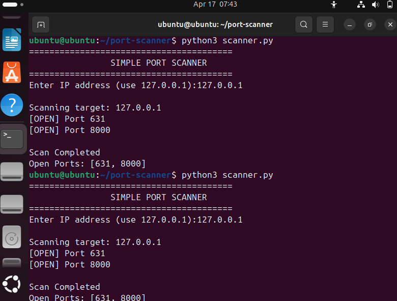
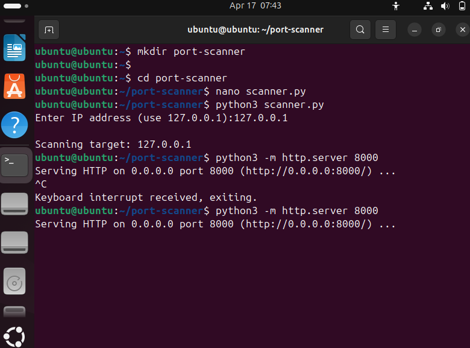

# Python Port Scanner

# Description
A simple Python-based port scanner that detects open ports on a target system.

# Features
- Scans ports from 1 to 9000
- Detects open TCP ports
- Displays real-time scanning output
- Shows final list of open ports

# How to Run
python3 scanner.py

Enter target IP:
127.0.0.1

# Output Example
Shows:
[OPEN] Port 631
[OPEN] Port 8000

# Learning Outcome
- Learned socket programming
- Understood how port scanning works
- Basic cybersecurity reconnaissance technique

 # Screenshots

# Scan Result

# Running Scanner

